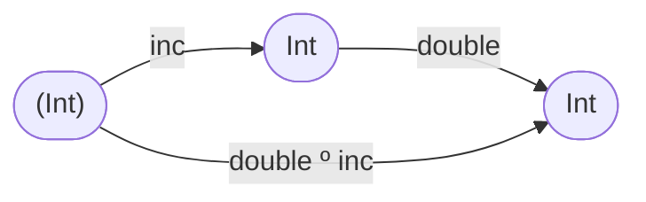
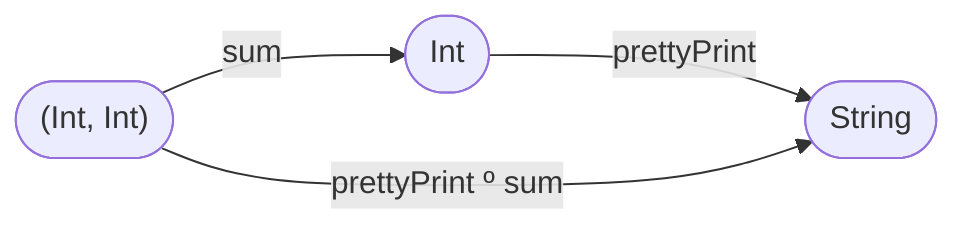

# Function composition

## Example

```mermaid
graph LR;
  A(["(Int)"]);
  B(["Int"]);
  C(["Int"]);
  
  A -- inc --> B -- double --> C;
  A -- double º inc --> C;
```

## Exercise

```mermaid
graph LR;
  A(["(Int, Int)"]);
  B(["Int"]);
  C(["String"]);

  A -- sum --> B -- prettyPrint --> C;
  A -- prettyPrint º sum --> C;
```
