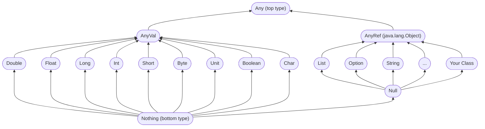

# Scala type lattice

```mermaid
graph BT;
    ANY_REF(["AnyRef (java.lang.Object)"])
    ANY_VAL([AnyVal])
    ANY(["Any (top type)"])
    DOUBLE([Double])
    FLOAT([Float])
    LONG([Long])
    INT([Int])
    SHORT([Short])
    BYTE([Byte])
    UNIT([Unit])
    BOOL([Boolean])
    CHAR([Char])
    LIST([List])
    OPTION([Option])
    STRING([String])
    CLASSES(["..."])
    USER_DEFINED(["Your Class"])
    NULL([Null])
    NOTHING(["Nothing (bottom type)"])

    NOTHING ---> DOUBLE & FLOAT & LONG & INT & SHORT & BYTE & UNIT & BOOL & CHAR --> ANY_VAL;
    NOTHING --> NULL --> LIST & OPTION & STRING & CLASSES & USER_DEFINED --> ANY_REF;
    ANY_VAL & ANY_REF --> ANY;
```
